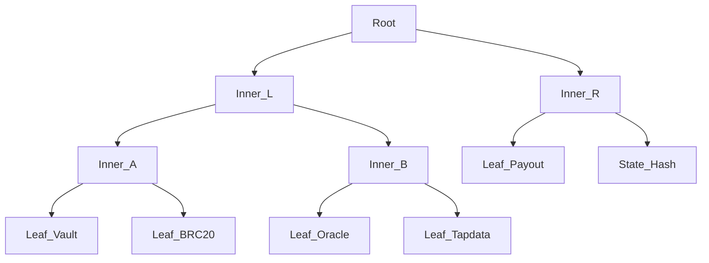

# PRECOP: The Predictive Covenant Oracle Protocol
**Yellowpaper: Sovereign Conditional State Machines and Thermodynamic Consensus on Bitcoin L1**
**Version:** 0.0.1 | **Date:** March 2026
**Authors:** laz1m0v (Lead Protocol Architect & Cryptography Engineer)


> *"Sovereign conditional states where the covenant is the consensus."*

---

## Abstract

The decentralization of complex state machines on the Bitcoin base layer (L1) has historically been hindered by the absence of Turing completeness and an inherent reliance on trusted oracles. The PRECOP (Predictive Covenant Oracle Protocol) addresses this asymmetry by introducing a strict cryptographic paradigm where the Taproot output key is a deterministic commitment to the system's state vector. By leveraging Taproot primitives (BIP-341, BIP-342) and Simplicity covenants via the **Astrolabe** pattern, PRECOP enables the instantiation of Sovereign Conditional State Machines—encompassing Prediction Markets, Automated Market Makers (AMMs), and Collateralized Synthetic Assets—directly onto the UTXO set. This paper formalizes the protocol's architecture, the deterministic serialization of state, the thermodynamic proof-of-work (Binohash), and the underlying mathematical invariants guaranteeing a robust Nash Equilibrium while substantially reducing discretionary trust.


---

## 1. Introduction & Architectural Philosophy

### 1.1. The Oracle Paradox and the Necessity of Thermodynamic Consensus

Within the ecosystem of cryptographic protocols, the "oracle problem" denotes the inability of a blockchain to autonomously and deterministically verify exogenous information. Historically, dominant architectures have mitigated this deficiency by introducing trusted federations (multisig quorums) or secondary consensus layers (Proof-of-Stake altchains). These models reintroduce vulnerabilities to Byzantine faults (BFT) and establish an asymmetry of trust that contradicts the fundamental axiom of Bitcoin: *Don't trust, verify*.

PRECOP redefines truth acquisition by subjecting it to a **Thermodynamic Consensus**. The resolution of an external condition is no longer a declarative act or a delegated vote; it is a cryptographic proof backed by tangible energy expenditure (Proof-of-Work). The protocol transmutes "trust in a third party" into "trust in thermodynamics and game theory."

### 1.2. Axiomatic Extension: Conditional State Machines

PRECOP's mathematical formalism facilitates the on-chain execution of Automated Market Makers (AMM) governing constant product liquidity curves ($x \cdot y = k$), as well as the management of sovereign collateral (the BTCDAI algorithmic stablecoin). The *Covenant*—the smart contract encoded within the Merkle Abstract Syntax Tree (MAST)—replaces discretionary trust with explicit cryptographic and economic constraints, acting as the arbiter of state transitions. This formalism also supports native Runes-compatible tokens via the same covenant structure (future extension).


### 1.3. Strictly Isolated 6‑Layer Architecture

To guarantee absolute determinism, PRECOP imposes strict domain separation. No network anomaly or asynchronous I/O operation can alter the state machine. Let $\mathcal{L}$ be the set of the protocol's layers:

*   **Layer 0 (On‑Chain Consensus):** The enforcement layer. Composed of Simplicity programs (6‑leaf MAST topology). It unconditionally rejects any transaction violating mathematical invariants.
*   **Layer 1 (Cryptographic Core):** The pure mathematics library (hashing functions, secp256k1 derivation, LMSR pricing). This layer formally proscribes the use of floating-point arithmetic.
*   **Layer 2 (Transactional Construction):** The orchestration of Witnesses and Taproot derivations. Handles the transition from an OPI-2 intent to a valid Bitcoin transaction.
*   **Layer 3 (IndexerClaw & LSVM):** The Local Simplicity Verification Module, a localized virtual machine replicating Layer 0 consensus. It natively handles chain reorganizations (reorgs) and enforces the `ConsensusGuardError`.
*   **Layer 4 (Runtime & Relay):** The transmission interface broadcasting transactions to the P2P network (Bitcoin L1 / Liquid).
*   **Layer 5 (DONCLAW Oracle Agents):** The decentralized network of autonomous entities executing heuristic inference (LLMs) coupled with cryptographic extraction (Binohash PoW).

### 1.4. Security Assumptions

The protocol's security properties rely on the following axiomatic assumptions:
1. **Oracle Honesty**: A majority of oracle agents (weighted by thermodynamic effort) remain economically honest.
2. **Computational Cost**: The **Binohash** grinding cost ($W=42$) remains non-trivial and resistant to sudden hardware-driven difficulty shifts.
3. **Determinism**: The **LSVM** implementations are bug-free and strictly consensus-compatible with the target environment.
4. **Integrity**: Taproot/Simplicity compilation artifacts used by verifiers match the source commitments defined in this paper.
5. **Entropy**: The **UTXOracle** price extraction remains sufficiently entropic; i.e., target Bitcoin blocks contain enough diverse payment-representative transactions.
6. **Policy Compliance**: Resolver nodes adhere to the batch inclusion policy, preventing adversarial divergence in intent ordering beyond protocol-level tolerance.


---

## 2. Sovereign State Model: Tapdata & BIP-341

The cornerstone of PRECOP resides in the **Astrolabe (Tapdata)** pattern. In traditional architectures, a contract's state is inscribed within the transaction payload (e.g., `OP_RETURN`). Conversely, PRECOP encodes the state as a scalar modifier of the UTXO's public key. Thus, **the Taproot output key is a deterministic commitment to the state vector**.


### 2.1. Topology of the State Vector ($\vec{S}_{L1}$)

To maximize efficiency on the Bit Machine, the market state is hyper-compressed into a 31-byte vector committed within the Taproot tweak.

| Offset | Size | Field | Definition & Type |
| :--- | :--- | :--- | :--- |
| 0x00 | 1 byte | `version` | Protocol version (0x05) |
| 0x01 | 8 bytes | `market_id` | Truncated SHA-256 prefix : uint64 BE |
| 0x09 | 1 byte | `phase` | Phase (1=OPEN, 2=VOTING, 3=RESOLVED) |
| 0x0A | 8 bytes | `q_yes` | YES share quantity : uint64 BE |
| 0x12 | 8 bytes | `q_no` | NO share quantity : uint64 BE |
| 0x1A | 4 bytes | `oracle_cnt` | Thermodynamic proof counter : uint32 BE |
| 0x1E | 1 byte | `resolution` | Outcome (0=PENDING, 1=YES, 2=NO) |


### 2.2. The BTCDAI Synthetic State Machine (31 bytes)

The state of a collateralization vault for the algorithmic stablecoin.

| Offset | Size | Field | Definition & Type |
| :--- | :--- | :--- | :--- |
| 0x00 | 1 byte | `version` | Protocol version (0x05) |
| 0x01 | 8 bytes | `vault_id` | Unique vault identifier : uint64 BE |
| 0x09 | 1 byte | `phase` | Phase (1=OPEN, 2=LIQUIDATED) |
| 0x0A | 8 bytes | `collateral` | Locked Satoshis : uint64 BE |
| 0x12 | 8 bytes | `debt` | Issued BTCDAI units : uint64 BE |
| 0x1A | 5 bytes | `reserved` | Zero-padded padding (u40) |

### 2.3. Deterministic State Mutation: Real Mutinynet Examples

| Step | State Vector Summary (key fields) | Resulting P2TR Address |
| :--- | :--- | :--- |
| **DEPLOY** | `version=05, phase=OPEN, q_yes=0, q_no=0` | `tb1pqrapnfj659sexmzc7wyk8vggujzr8xx2t25ssvkmlrg5f4h2xazqfxdg9n` |
| **BUY 100 YES** | `version=05, phase=OPEN, q_yes=100, q_no=0` | `tb1plx6kjurkfuuev3rv6gs3229mfgkg9k8flrvnnadqr748hlw7pnmsnx6jn6` |
| **RESOLVED (YES)** | `version=05, phase=RESOLVED, q_yes=100, q_no=0, resolution=1, oracle_cnt=42` | `tb1pzn9wk89awlagheqj29zsa0tt2esq5u8etap6wx80tn8806xrrqxsyy5taj` |

Each valid state spend MUST pay to the next address in the sequence, enforced by the Simplicity `jet::build_taptweak`.


### 2.4. Taproot Key Derivation ($Q$) and the Transition Invariant

Let $P$ be the internal **NUMS** key (nothing-up-my-sleeve) defined as:
$$P = \mathtt{0x50929b74c1a04954b78b4b6035e97a5e078a5a0f28ec96d547bfee9ace803ac0}$$

The final output public key $Q_t$ for state $\vec{S}_t$ is tweaked by the Merkle Root $M_t$ of the 6-leaf MAST:
$$Q_t = P + \mathrm{tagged\_hash}(\mathrm{TapTweak}, P \parallel M_t)G$$

**The Axiomatic Transition Theorem:** A state transition is valid if and only if the Simplicity Covenant verifies that $\vec{S}_{t+1} = \Upsilon(\vec{S}_t, I_t, W_t)$ and that the output UTXO is locked under $Q_{next}$ (derived from $\vec{S}_{t+1}$), where:
- $\vec{S}_t$ is the current state vector.
- $I_t$ is the canonical intent or operation payload (OPI-2).
- $W_t$ is the witness or hint set (e.g., pricing ZKP-hints) required by the covenant logic.

In practice, this is enforced by the Simplicity instruction `jet::build_taptweak` which recomputes the new commitment from the mutated state vector before allowing the spend.


---

## 3. Covenant Topology: The 6-Leaf MAST

To remain within the computational bounds of the Bit Machine while supporting complex AMM and stablecoin logic, PRECOP decomposes its validation rules into a 6-leaf **Merkle Abstract Syntax Tree (MAST)**.

### 3.1. Cryptographic Identity (CMR)

The commitment to the protocol's rules is defined by the **Commitment Merkle Root (CMR)** of the Simplicity programs. These hashes are the immutable law of the protocol.

| Contract | Role | CMR (Identity) | TapLeaf Hash (Path) | Artifact Status |
| :--- | :--- | :--- | :--- | :--- |
| `vault_binohash.simf` | **Main Router** | `8a4d0163...` | `0550a41e...` | **Compiled simc v0.0.1** |
| `brc20_token.simf` | **Token Sentinel** | `f99b37f7...` | `2b48008e...` | **Compiled simc v0.0.1** |
| `oracle_validation.simf` | **Truth Mining** | `3debe...` | `bce51d4b...` | **Compiled simc v0.0.1** |
| `tapdata_state.simf` | **State Invariant** | `1c36b...` | `565708f1...` | **Compiled simc v0.0.1** |
| `payout_enforcement.simf`| **Distribution** | `39ff3...` | `b80d9a46...` | **Compiled simc v0.0.1** |
| `w_token.simf` | **W Token Covenant** | `84d676...` | `97ff122c...` | **Compiled simc v0.0.1** |

**Global MAST Root (calculated from all leaves)**: `3225331c38dccf5707be0e07b97518ddb2471c51c1202325c58b27da5f968eef`

### 3.2. MAST Topology

The root $M$ is derived from the following hierarchy:

This topology ensures that verifying a simple trade (Path: Vault + Tapdata) is computationally cheaper than verifying a market resolution (Path: Payout + Oracle).

---

## 4. OPI Framework: Transcending the Intent Standards

PRECOP does not merely adopt the OPI-1 and OPI-2 standards; it **transcends** them. While these standards define a logical framework for off-chain interpretation, PRECOP compiles their semantic rules — swap logic, liquidity locks, and emission schedules — directly into the Simplicity MAST (Layer 0). The covenant becomes the ultimate, deterministic executor of the OPI constitution: every state transition is validated at the consensus level, making the UTXO set itself the canonical, sovereign state machine.

### Transport vs. Protocol — An Explicit Distinction

PRECOP is **not** a BRC-20 protocol. It is an autonomous Simplicity-covenant state machine that happens to use the BRC-20 JSON envelope `{"p":"brc-20",...}` as a **broadcast transport**, for one reason: every BRC-20-aware indexer on the network can see these transactions without any software upgrade. This is a deliberate infrastructure decision, not a protocol dependency.

The authority hierarchy is unambiguous:

| Layer | Authority | Who decides validity? |
|-------|-----------|----------------------|
| JSON v3 envelope `{"p":"brc-20"}` | **None** | Indexer routing only — not a truth claim |
| PRECOP IndexerClaw (LSVM) | **Structural** | Rejects malformed intents before L1 |
| Simplicity Covenant (MAST) | **Absolute** | The only arbiter of state truth |

If the JSON says `"amt":600` but the covenant witnesses fail, the state transition is rejected. The JSON is a signal; the covenant is the law.

For data availability, PRECOP encodes all intents into a compact binary format constrained to the 80-byte `OP_RETURN` limit. This transport-layer optimization preserves exact semantic fidelity with the OPI-1 and OPI-2 canonical JSON specifications.

### 4.1. PRECOP Opcode Map (OPI-1 & OPI-2)

The following tables define the complete binary opcode space. Opcodes `0x01`–`0x20` cover prediction market operations; `0x0A`–`0x0C` cover composite payments and W-stake slashing; `0x51`–`0x53` cover BTCDAI synthetic operations; `0x54`–`0x56` cover W wrapped BTC token operations; `0x60`–`0x65` implement the OPI-1 AMM, OPI-2 Curve, and OPI-3 W-AMM operations. Total: **20 registered processors**.

**Prediction Market opcodes:**

| Opcode | Operation | OPI | Size (bytes) | Structure |
| :--- | :--- | :--- | :--- | :--- |
| `0x01` | **DEPLOY** | Internal | 14 | `[PREC][0x05][0x01][tick4][params]` |
| `0x02` | **BUY** | Internal | 15 | `[PREC][0x05][0x02][tick4][side][qty_u32]` |
| `0x03` | **SELL** | Internal | 15 | `[PREC][0x05][0x03][tick4][side][qty_u32]` |
| `0x10` | **VOTE** | Internal | 38 | `[PREC][0x05][0x10][tick4][outcome][nonce32]` |
| `0x11` | **SLASH** | Internal | 15 | `[PREC][0x05][0x11][tick4][oracle_ref]` |
| `0x20` | **RESOLVE** | Internal | 17 | `[PREC][0x05][0x20][tick4][outcome][block_u24]` |
| `0x70` | **SELL_L** | Internal | 42 | `[PREC][0x05][0x70][tick4][qty32][price64][seller128]` |

**BTCDAI Synthetic opcodes:**

| Opcode | Operation | OPI | Size (bytes) | Structure |
| :--- | :--- | :--- | :--- | :--- |
| `0x51` | **BTCDAI_MINT** | Internal | 30 | `[PREC][0x05][0x51][col_u64][debt_u64][price_raw]` |
| `0x52` | **BTCDAI_BURN** | Internal | 22 | `[PREC][0x05][0x52][vault_id_u64][debt_u64]` |
| `0x53` | **BTCDAI_LIQ** | Internal | 22 | `[PREC][0x05][0x53][vault_id_u64][price_raw]` |

**W Token opcodes (1:1 wrapped BTC):**

| Opcode | Operation | OPI | Size (bytes) | Structure |
| :--- | :--- | :--- | :--- | :--- |
| `0x54` | **W_MINT** | Internal | 22 | `[PREC][0x05][0x54][deposit_sats_u64][mint_units_u64]` |
| `0x55` | **W_BURN** | Internal | 22 | `[PREC][0x05][0x55][vault_id_u64][burn_units_u64]` |
| `0x56` | **W_LIQ** | Internal | 22 | `[PREC][0x05][0x56][vault_id_u64][price_raw]` |

**Composite Payment opcodes (atomic vault burn → market buy):**

| Opcode | Operation | OPI | Size (bytes) | Structure |
| :--- | :--- | :--- | :--- | :--- |
| `0x0A` | **COMPOSITE_W** | Internal | 30 | `[PREC][0x05][0x0A][vault_id_u64][market_id_u64][side][burn_units_u64]` |
| `0x0B` | **COMPOSITE_BTCDAI** | Internal | 30 | `[PREC][0x05][0x0B][vault_id_u64][market_id_u64][side][burn_units_u64]` |

**W-Stake Slashing opcode:**

| Opcode | Operation | OPI | Size (bytes) | Structure |
| :--- | :--- | :--- | :--- | :--- |
| `0x0C` | **W_SLASH** | Internal | 72 | `[market_id(16)][oracle_pubkey(32)][side1(1)][nonce1(8)][side2(1)][nonce2(8)]` |

**OPI-1 AMM opcodes (swap):**

| Opcode | Operation | OPI | Size (bytes) | Structure |
| :--- | :--- | :--- | :--- | :--- |
| `0x60` | **SWAP_INIT** | OPI-1 `swap init` | 22 | `[PREC][0x05][0x60][tick_A(4)][tick_B(4)][amt(8)][lock(4)]` |
| `0x61` | **SWAP_EXE** | OPI-1 `swap exe` | 22 | `[PREC][0x05][0x61][tick_given(4)][tick_recv(4)][amt(8)][slip(2)]` |

**OPI-2 Curve opcodes (emission):**

| Opcode | Operation | OPI | Size (bytes) | Structure |
| :--- | :--- | :--- | :--- | :--- |
| `0x62` | **CURVE_DEPLOY** | OPI-2 `curve deploy` | 26 | `[PREC][0x05][0x62][tick_y(4)][tick_reward(4)][schedule(2)][genesis_fee(8)]` |
| `0x63` | **CURVE_CLAIM** | OPI-2 `curve claim` | 18 | `[PREC][0x05][0x63][tick_y(4)][tick_reward(4)][amount(4)]` |

**OPI-3 W-AMM opcodes (sovereign W token pools):**

| Opcode | Operation | OPI | Size (bytes) | Structure |
| :--- | :--- | :--- | :--- | :--- |
| `0x64` | **W_AMM_INIT** | OPI-3 `w_amm init` | 26 | `[PREC][0x05][0x64][tick_A(4)][tick_B(4)][amt_A(8)][amt_B(8)][lock(2)]` |
| `0x65` | **W_AMM_SWAP** | OPI-3 `w_amm exe` | 22 | `[PREC][0x05][0x65][tick_in(4)][tick_out(4)][amt_in(8)][slip(2)]` |

The W-AMM pools implement the same constant-product invariant as OPI-1 ($x \cdot y = k$) but operate natively on W wrapped BTC tokens, with a 30 BPS fee applied to `amt_in` before the swap computation. Pool identity is derived from `compute_pool_id(tick_a, tick_b)` with lexicographic ordering.

### 4.2. Gamified Batching and Disagreement Calibration

To solve the "Hot UTXO" problem, OpenClaw nodes batch multiple intents into a single transaction.
- **ConsensusGuardError**: The LSVM MUST perform a FULL bit-by-bit verification for critical operations (`RESOLVE`, `PAYOUT`, `BTCDAI`).
- **Slashing Incentives**: A node submitting an invalid batch loses its mining fees, while honest verifiers are rewarded through a protocol-level bond system.

### 4.3. Formal Specification of Canonical Batching (CBM)

To resolve the "Hot UTXO" contention bottleneck while maintaining full deterministic auditability, PRECOP implements a **Canonical Batch Model (CBM)**. This model strictly separates the user's intent from the computational execution of state transitions.

#### 1. Canonical Sequencing ($\Pi$)
Let $\mathcal{B} = \{i_1, i_2, ..., i_k\}$ be a proposed batch of $k$ OPI-2 intents. To prevent the Resolver (the batch constructor) from strategically reordering intents to extract value (MEV), the execution sequence is determined by a deterministic permutation $\Pi$:
$$\Pi(\mathcal{B}) = \mathrm{sort\_lexicographical}(\{\text{SHA256}(i) \mid i \in \mathcal{B}\})$$
The IndexerClaw (LSVM) rejects any batch where the execution order deviates from this cryptographic sort.

#### 2. Atomic Multi-State Transition ($\Upsilon^*$)
The transition from state $\vec{S}_t$ to $\vec{S}_{t+k}$ is defined as the recursive application of the transition function $\Upsilon$:
$$\vec{S}_{t+j} = \Upsilon(\vec{S}_{t+j-1}, i_j, W_j) \quad \text{for } j = 1 \dots k$$
The resulting L1 transaction proves that the starting state corresponds to the currently available anchor and that the final output public key $Q_{t+k}$ matches the cumulative result of all $k$ operations.

#### 3. ConsensusGuard Invariant
A Resolver node broadcasting a batch $\mathcal{B}$ must provide the full witness stack $\{W_1, ..., W_k\}$. A batch is considered **Protocol-Invalid** if:
1. The lexicographical order of intents is violated.
2. Any single intent $i_j$ fails its Simplicity invariant within the recursive sequence.
3. The resulting Taproot tweak does not match the on-chain output address.

#### 4. Hot UTXO Mitigation
By consolidating $k$ intents into a single L1 transition, PRECOP reduces the settlement footprint and ensures that the system handles transaction volume at the throughput limit of the Bit Machine (Layer 0), rather than the block arrival rate (Layer 4). This guarantees a high-velocity state machine while maintaining Bitcoin-level finality for the batch.

#### 5. Lock Expiration Priority
At the beginning of each new block's processing — before any other operation in that block is evaluated — all liquidity positions whose `lock` duration has elapsed are **atomically returned** to their owners' available balances. This is an unconditional invariant enforced by the IndexerClaw's `BatchEngine`: expired locks are never deferred to a subsequent block, and no intent within the current block can interact with a position during the same instant it expires. This strict ordering prevents timing-based exploits where a swap could front-run an expiring locked position within the same block.

### 4.4. Faithful Implementation of OPI-1 Semantics

A critical design invariant is that PRECOP's binary encoding of OPI intents is a **transport-layer optimization**, not a semantic alteration. The compact binary payload is a strictly isomorphic projection of the canonical OPI-1 JSON object: every field maps one-to-one with no loss of meaning.

| OPI-1 JSON Field | Binary Encoding | Type | Semantics |
| :--- | :--- | :--- | :--- |
| `op: "swap", init` | `0x01` (DEPLOY) | opcode | Pool creation / liquidity provision |
| `op: "swap", exe` | `0x02`/`0x03` (BUY/SELL) | opcode | Swap execution |
| `amt` | `qty_u32` | uint32 BE | Integer token quantity |
| `lock` | `params[lock_u16]` | uint16 BE | Lock duration in Bitcoin blocks |
| `slip` | `params[slip_u16]` | uint16 BPS | Slippage tolerance in basis points |

This 1:1 semantic mapping guarantees **full backward compatibility**: any indexer implementing OPI-1 JSON can trivially decode the binary payload — and vice versa — by applying the deterministic codec defined in `opreturn_codec.py`. The covenant enforces these same semantic rules at Layer 0, ensuring that no Resolver node can deviate from the OPI-1 state machine logic without the Simplicity script unconditionally rejecting the transaction.

**Concrete mapping example — `swap exe`:**

The following OPI-1 JSON intent:
```json
{ "p": "brc-20", "op": "swap", "exe": "wtf,lol", "amt": "21", "slip": "0.5" }
```
maps deterministically to the 22-byte binary payload `0x61`:
```
PREC  ver   op    tick_given  tick_recv   amt (8B BE)          slip (BPS)
50524543 05  61   77746600    6C6F6C00    0000000000000015     0032
```
where `slip` `"0.5%"` is encoded as `50` basis points (`uint16 BE = 0x0032`). The IndexerClaw's `opreturn_codec.py` performs this mapping in both directions, and the Simplicity leaf verifies the resulting $u128$ cross-multiplication inequality at Layer 0.

### 4.5. Protocol Comparison Table

| Feature | BRC-20 / Runes | PRECOP (OPI-2) |
| :--- | :--- | :--- |
| **State Storage** | External DB / Indexer | **Taproot Key Commitment** |
| **Verification** | Social / Off-chain | **L1 Covenant (Simplicity)** |
| **AMM Support** | None / Centralized | **Native (x*y=k Invariant)** |
| **Collateral Logic** | None | **Native 150%/120% (On-chain)** |
| **Oracle Resolution** | None / Trusted | **Thermodynamic Binohash** |
| **Data Footprint**| High (Inscription) | **Minimal (Taproot + OP_RETURN)** |
| **State Validity** | Social / Off-chain | **Deterministic (Atomic)** |
| **Settlement Finality**| Chain-confirmation based| **Chain-confirmation based** |


---

## 5. Financial Mathematics & Invariants

### 5.1. Deterministic LMSR Pricing

The LMSR cost increment $\Delta_{cost}$ for acquiring $\Delta_{shares}$ is verified using ZKP-Hints $E_y = \exp(q_y/b)$ and $E_n = \exp(q_n/b)$. The covenant enforces:
$$\Delta_{cost} \cdot (E_y + E_n) \approx E_y \cdot S \pm \epsilon$$
Evaluated on $u128$ to avoid any floating-point or division errors, where:
- $S$ is the protocol-level fixed-point scaling factor ($10^8$).
- $\epsilon$ is the protocol-level bounded approximation tolerance for integer math.


### 5.2. OPI-1 AMM Invariants

The swap execution layer implements the constant-product AMM invariant ($x \cdot y = k$) defined by OPI-1. For a pool with reserves $(R_x, R_y)$, a swap offering $\Delta_x$ units of token $X$ yields an output:

$$\Delta_y = \frac{R_y \cdot \Delta_x}{R_x + \Delta_x}$$

The covenant enforces this on $u128$ via cross-multiplication, avoiding any division or floating-point:

$$\Delta_y \cdot (R_x + \Delta_x) \approx R_y \cdot \Delta_x \pm \epsilon$$

**Slippage Enforcement — Mandatory Partial Fill:** Per OPI-1 Rule 5, an `exe` operation whose requested $\Delta_x$ would cause the effective price to exceed the user's declared `slip` tolerance is **never outright rejected**. Instead, it is subject to a mandatory partial fill: the protocol computes the maximum $\Delta_x^* \leq \Delta_x$ such that the resulting price impact remains within the stated tolerance. Formally:

$$\Delta_x^* = \max \left\lbrace \delta \leq \Delta_x \mid \frac{R_y \cdot \delta}{R_x + \delta} \geq \Delta_y^{\min} \right\rbrace$$

where $\Delta_y^{\min} = \Delta_y^{\text{ideal}} \cdot (1 - \text{slip}/100)$. The partial fill quantity is validated via the same $u128$ inequality, guaranteeing no floating-point is introduced at any layer. This rule ensures continuous market liquidity and prevents griefing attacks that would stall execution by submitting orders designed to be unfillable.

**Pool Canonical Identity:** The pool identifier is derived from the lexicographic ordering of its token ticker pair (e.g., `lol-wtf`), enforced by the IndexerClaw at validation time to prevent liquidity fragmentation across equivalent pairs with reversed orderings.

#### 5.2.1. OPI-1 Behavioural Rules (Normative)

The following rules are normative per the OPI-1 specification [6] and enforced by both the IndexerClaw (Layer 3) and the Simplicity MAST (Layer 0):

**Lock Enforcement:** Any `swap init` (`0x60`) operation **must** include a positive `lock` value (in Bitcoin blocks ≥ 1). The covenant verifies that the provided liquidity remains inaccessible until the specified block height, enforcing the "Total Lock-up Model" mandated by OPI-1. This structurally eliminates mercenary liquidity by mandating skin-in-the-game from every liquidity provider.

**Mandatory Partial Fill:** When a `swap exe` (`0x61`) request would cause the effective price to exceed the user's `slip` tolerance, the transaction is **never rejected** for this reason. Instead, it is automatically partially filled to the maximum amount that respects the slippage bound (see §5.2 for the formal computation). The final exchanged quantities are computed by the IndexerClaw and validated on-chain by the covenant using the $u128$ cross-multiplication inequality.

**Identity Binding:** The operator's identity is derived exclusively from the address controlling `Input[0]` of the transaction, as specified by OPI-1. All balance debits and credits — for both the operator and all affected liquidity providers — are atomically applied to this identity. No off-chain identity system is required or accepted.

**Lock Expiration Priority:** At the beginning of each new block, the IndexerClaw processes all expired liquidity locks before evaluating any other operation in that block. This guarantees that unlocked funds are available for the block's transactions. The ordering is: *(1) expire locks → (2) canonical sequencing Π → (3) execute batch*. This corresponds to CBM Rule 5 (§4.3).

### 5.3. BTCDAI Collateralization Invariants

#### 5.3.0. The BTCDAI Token Architecture

BTCDAI is a **BRC-20 token with `max` and `limit` set to zero**. This unconventional configuration is intentional and essential: it signals to all indexers that BTCDAI's total supply is **not governed by the standard BRC-20 mint rules**, but exclusively by the Simplicity covenant `brc20_token.simf`. The supply is fully elastic and controlled by the following dedicated opcodes:

| Opcode | Operation | Trigger Condition |
| :--- | :--- | :--- |
| `0x51` | **BTCDAI_MINT** | Collateral deposited; covenant verifies 150% ratio |
| `0x52` | **BTCDAI_BURN** | User returns BTCDAI; covenant releases proportional collateral |
| `0x53` | **BTCDAI_LIQ** | Liquidation threshold breached; covenant distributes collateral |

New BTCDAI can only be created when backed by sufficient Bitcoin collateral, and destroyed only when collateral is released or seized. No BTCDAI can exist outside of a vault backed by a locked UTXO. This design transforms BTCDAI from a simple token into a **fully collateralized, algorithmically stable asset** whose supply dynamically adjusts to user demand while the covenant guarantees perpetual solvency.

| BRC-20 Parameter | Standard BRC-20 | BTCDAI |
| :--- | :--- | :--- |
| `max` | Total supply cap | **0** (covenant-controlled) |
| `limit` | Per-mint cap | **0** (covenant-controlled) |
| Mint authority | Anyone | **`brc20_token.simf` only** |
| Burn authority | None | **`brc20_token.simf` only** |

#### 5.3.1. On-Chain Invariants

- **Minting**: $\text{Collateral} \times \text{Price}_{btc} \ge \text{Debt} \times 1.5 \times 10^8$.
- **Liquidation**: $\text{Collateral} \times \text{Price}_{btc} < \text{Debt} \times 1.2 \times 10^8$.
- **Price Feed**: Provided by **UTXOracle v9.1** (see Section 5.4 for the complete 12-step algorithm).


### 5.4. UTXOracle v9.1: Trustless Price Extraction

PRECOP resolves the collateralization of BTCDAI using **UTXOracle v9.1**, a 12-step deterministic algorithm that extracts the BTC/USD price directly from on-chain transaction patterns.

#### The 12-Step Deterministic Process:
1.  **Blockstream Connection**: Connects to the local Bitcoin Core node via JSON-RPC.
2.  **Temporal Chain Sync**: Maps the target UTC date to the corresponding block range.
3.  **Raw Ingestion**: Fetches full block data (verbosity=0) for the specified range.
4.  **Isomorphism Filtering**: Discards coinbase, OP_RETURN, and high-complexity transactions. Only "payment-representative" UTXOs (1-5 inputs, exactly 2 outputs) are kept.
5.  **Artifact Cleaning**: Identifies and removes "change" outputs by tracking same-day transaction graphs.
6.  **Log-Scale Binning**: Maps remaining output amounts into 1,200 logarithmic bins (1e-6 to 1e6 BTC).
7.  **Noise Nullification**: Specifically nullifies bins corresponding to round-BTC amounts (e.g., exactly 1.0 BTC) to remove deliberate signal spoofing.
8.  **USD Pattern Analysis**: Slides a Gaussian "weighted-stencil" across the histogram, representing common USD payment sizes ($10, $50, $100, $1000).
9.  **Correlation Scoring**: Computes the score for every possible BTC/USD price slide.
10. **Rough Extraction**: Identifies the peak correlation slide as the initial price signal.
11. **Center-of-Mass Convergence**: Iteratively refines the price within a tight range (±5%) until it converges to the sub-cent level.
12. **Final Quantization**: Rounds the result to the nearest cent ($\mathtt{uint64}$ BE).

#### Anti-Manipulation Invariants:
- **Entropy Requirement**: If a block has fewer than 100 valid outputs, it is rejected to prevent low-entropy price forging.
- **RPC-Only**: The entire process is executed without TLS or DNS lookups, strictly using the local authenticated RPC.

The final price (uint64 cents) is injected into the witness stack of every BTCDAI_MINT/BURN/LIQ transaction and verified on-chain by `brc20_token.simf` using `le_128` cross-multiplication. This guarantees zero-trust collateralization within the bounds of the price extraction algorithm's entropy. This on-chain price feed, combined with the `le_128` cross-multiplication in `brc20_token.simf`, guarantees that BTCDAI can never be minted or burned without verifiable over-collateralization — a level of sovereignty impossible with BRC-20 or Runes alone.


### 5.5. W Token: Wrapped BTC as a Sovereign BRC-20

The **W token** is a BRC-20 token with a strict **1:1 peg** to BTC, where 1 W unit = 1 satoshi. Like BTCDAI, it uses `max=0, lim=0` to signal that supply is exclusively covenant-controlled. The three W opcodes mirror the BTCDAI lifecycle:

| Opcode | Operation | Invariant |
| :--- | :--- | :--- |
| `0x54` | **W_MINT** | `deposit_sats == mint_units` (strict 1:1 identity) |
| `0x55` | **W_BURN** | `release_sats × old_debt ≤ burn_units × old_collateral` (cross-mult) |
| `0x56` | **W_LIQ** | Stablecoin mode only: `col × price < debt × W_LIQ_RATIO` |

The W token serves as the unified value layer across the protocol: oracle staking (§7.3), AMM liquidity (§7.4), and composite payments (§7.4). By wrapping BTC into a BRC-20 token, PRECOP enables atomic on-chain operations (burn, slash, swap) that would require multi-step settlement with raw satoshis.

---

## 6. Prediction Markets as BRC-20 Conditional Tokens

PRECOP transforms binary prediction markets into a native BRC-20 asset exchange. Each outcome (`YES` / `NO`) is represented as a distinct BRC-20 token, minted and burned atomically with market trades. This section describes the complete lifecycle of a market, the role of the covenant, and the deterministic UTXO templates that guarantee state consistency.

### 6.1. Market Lifecycle Overview

A prediction market in PRECOP progresses through four canonical phases, each enforced by the Simplicity covenant:

1. **Deploy** — The creator initializes a market, defining the question, liquidity parameter `b`, and lock duration. The covenant generates a unique **market ID**. Two outcome ticker names are reserved: `{prefix}_YES` and `{prefix}_NO`. Their supply is **exclusively covenant-controlled** (signalled by `max=0, lim=0` in the BRC-20 transport envelope — this is a convention, not a BRC-20 protocol feature). No token can exist outside of an active vault state.
2. **Trading** — Participants buy or sell shares by submitting BRC-20 `pre` (PRECOP extension) transactions. The covenant verifies the LMSR pricing via ZKP-hints and atomically mints/burns the corresponding outcome tokens.
3. **Voting** — DONCLAW oracles submit votes with Binohash PoW ($W=30/42/50$ depending on stake tier) and a W-stake (min 0.01 BTC in W tokens, or 10,000 sats legacy). The covenant records votes and updates the on-chain oracle counter. See §7.3 for the tiered staking model.
4. **Resolution** — After the voting period, the covenant determines the majority outcome. It distributes the vault's satoshi balance according to the 50/30/20 rule, and burns all outstanding outcome tokens. The protocol treasury receives its 20% share.

### 6.2. BRC-20 Token Mechanics for Outcomes

Each market deploys two BRC-20 tokens with the following immutable properties:

- **Ticker format**: `{4-byte market prefix}_YES` and `{4-byte market prefix}_NO` (e.g., `a1b2_YES`).
- **Supply**: `max = 0` and `lim = 0`. This special configuration — identical to BTCDAI — indicates that the token's total supply is **not** governed by standard BRC-20 rules, but exclusively by the Simplicity covenant. The covenant mints new tokens on every valid `BUY` and burns them on every `SELL` or at resolution. This ensures perfect 1:1 correspondence between on-chain shares and the vault's internal state variables $q_{yes}$ and $q_{no}$.

**Minting condition (BUY):**
```json
{ "p": "brc-20", "op": "pre", "exe": "BTC,YES", "amt": 600 }
```
The covenant verifies that the LMSR cost is paid, then atomically increments $q_{yes}$ in the vault state and mints exactly `600` tokens of `_YES` to the buyer's address via a dedicated UTXO output.

**Burning condition (SELL):**
```json
{ "p": "brc-20", "op": "transfer", "tick": "YES", "amt": "300" }
```
The absence of a `to` field signals a **sell/burn** operation. The covenant decrements $q_{yes}$ and burns `300` tokens from the seller's balance. No new output is created; the covenant verifies the seller possesses sufficient tokens before allowing the vault state transition.

### 6.3. Atomic UTXO Template for Trading

Every `BUY` transaction must follow a canonical output structure to maintain perfect auditability and prevent double-spending:

| Output | Purpose | Script | Value |
| :--- | :--- | :--- | :--- |
| **0** | New Vault state | P2TR with updated Tapdata | Vault's total satoshis (including cost paid) |
| **1** | OP_RETURN intent | `OP_RETURN <binary payload>` | 0 |
| **2** | Token UTXO | P2TR/P2WPKH to buyer | `TOKEN_DUST_SATS` (330 sats) |
| **3** | Change | Back to buyer | Remaining inputs minus fees |

**Output 2** is the critical innovation: it transfers the newly minted BRC-20 tokens to the buyer. The covenant enforces that the token amount encoded in the OP_RETURN exactly matches the delta in $q_{yes}$ or $q_{no}$, and that the receiving address matches the transaction sender. For `SELL` transactions, no token output is created; the burn is signalled solely by the OP_RETURN.

### 6.4. Creator Dust Pool and Parallel Throughput

To overcome Hot UTXO contention, PRECOP introduces the **Creator Dust Pool** during market deployment. The deploy transaction creates $N$ identical UTXOs all locked under the same initial vault address $Q_0$:

```
Outputs: [OP_RETURN] [Vault Q₀] [Change] [Dust₁ Q₀] [Dust₂ Q₀] ... [Dustₙ Q₀]
```

Each dust UTXO (value `TOKEN_DUST_SATS = 330`) is independently spendable within the same block, allowing up to $N$ parallel trades. The covenant accepts any spend from any of these UTXOs as long as the new state $Q_1$ is correctly derived. After the first trade, the remaining dust UTXOs reference an outdated state and become unspendable, but the parallel throughput window has been exploited. This is a permissionless, covenant-enforced solution to the UTXO contention problem enabling high-frequency trading directly on Bitcoin L1.

### 6.5. Covenant Enforcement of LMSR Pricing

The LMSR cost for a trade is verified using ZKP-hints injected into the witness stack. The covenant `tapdata_state.simf` implements the exact integer inequality:

$$\Delta_{cost} \cdot (E_y + E_n) \le (E_y + \epsilon) \cdot \text{SCALE}$$

where $E_y$, $E_n$ are the scaled exponentials provided by the IndexerClaw, $\text{SCALE} = 10^8$, and $\epsilon = 10^4$. This ensures that the price paid matches the LMSR formula within a bounded approximation, with zero floating-point arithmetic at any layer.

---

## 7. DONCLAW: Thermodynamic Oracle Consensus

### 7.1. Binohash PoW ($W=42$)


Truth is "extracted" rather than voted. An oracle vote $V$ is valid if and only if:
$$\mathrm{Hi64}(\mathrm{SHA256}(\mathrm{market\_id} \parallel \mathrm{pubkey} \parallel \mathrm{outcome} \parallel \mathrm{nonce})) \le 2^{64-42} - 1$$
This requires $\approx 4.4$ trillion hashes per vote, anchoring the market resolution in tangible energy. The Binohash cost is identity-bound insofar as stake UTXOs, key registration, and double-voting slashing are enforced by the covenant.


### 7.2. Legacy Deterministic Slashing

If an identity signs two contradictory outcomes for the same market, Leaf C (`oracle_validation.simf`) allows any external observer to confiscate the oracle's **10,000 satoshi bond** by providing the two conflicting PoW fingerprints. This mechanism remains active for backward-compatible legacy staking.

### 7.3. W-Stake: Economic Oracle Security

PRECOP transitions oracle staking from raw satoshis to **W wrapped BTC tokens** (tick `"W"`, 1:1 peg with BTC). This architectural upgrade provides three critical advantages:

1. **Sybil Resistance (×100):** The minimum W-stake of 0.01 BTC (1,000,000 W units) raises the cost of identity fragmentation by two orders of magnitude compared to the legacy 10,000 satoshi bond.
2. **Native Slashing:** W token burns are atomic — the `brc20_token.simf` covenant handles the burn in a single transaction, eliminating multi-step settlement for equivocation penalties.
3. **Fee Alignment:** Oracle stake denominates in the same asset (W) used across AMM pools and composite payments, creating unified economic incentives.

#### 7.3.1. Staking Modes

The Binohash difficulty parameter $W$ scales inversely with stake size, creating a tiered security model:

| Mode | Minimum Stake | W Units | Binohash $W$ | Energy Cost | Use Case |
| :--- | :--- | :--- | :--- | :--- | :--- |
| **LIGHT** | 0.001 BTC | 100,000 | 30 | ~$10^9$ hashes | Low-value markets |
| **HEAVY** | 0.005 BTC | 500,000 | 50 | ~$10^{15}$ hashes | High-stakes markets |
| **STANDARD** | 0.01 BTC | 1,000,000 | 42 | ~$4.4 \times 10^{12}$ hashes | Default production |
| **LEGACY** | 10,000 sats | — | 42 | ~$4.4 \times 10^{12}$ hashes | Backward compat |

Mode resolution is deterministic: `resolve_stake_mode(w_balance)` returns the highest tier for which the oracle's W balance meets the minimum threshold. The `LEGACY` mode is selected when the oracle stakes raw satoshis instead of W tokens.

#### 7.3.2. W_SLASH OP_RETURN Encoding

The `W_SLASH` operation (opcode `0x0C`) is a 72-byte binary OP_RETURN that carries two conflicting Binohash proofs for the same oracle:

| Offset | Size | Field | Description |
| :--- | :--- | :--- | :--- |
| 0x00 | 16 bytes | `market_id` | Market identifier |
| 0x10 | 32 bytes | `oracle_pubkey` | Equivocating oracle's public key |
| 0x30 | 1 byte | `side_1` | First vote outcome (1=YES, 2=NO) |
| 0x31 | 8 bytes | `nonce_1` | First Binohash nonce (uint64 BE) |
| 0x39 | 1 byte | `side_2` | Second vote outcome (must differ from `side_1`) |
| 0x3A | 8 bytes | `nonce_2` | Second Binohash nonce (uint64 BE) |

**Validation invariants:**
- `side_1 != side_2` (equivocation proof)
- Both `(market_id, oracle_pubkey, side_i, nonce_i)` must pass `verify_binohash(W)`
- The oracle must hold a valid W-stake with tick `"W"` and amount ≥ `W_STAKE_MIN_UNITS`

**Processing effect:** On valid W_SLASH, the oracle's entire W-stake is atomically burned (negative `TokenBalanceModel` delta) and credited to the Protocol Treasury. All `VoteModel` entries for the equivocating oracle are marked `slashed=True`.

#### 7.3.3. Covenant Leaf: Path 6 (W_Slash)

The `oracle_validation.simf` MAST adds a sixth leaf specifically for W-stake slashing:

```
Path 6: W_Slash
  Precondition: input[0].tick == "W" AND input[0].amount >= MIN_W_STAKE
  Verification: verify_binohash(proof1) AND verify_binohash(proof2) AND side1 != side2
  Effect:       burn(input[0].amount) -> TREASURY_ADDRESS
```

This leaf coexists with the existing 5-leaf topology. The MAST commitment hash is updated accordingly in the Taproot tweak computation, but the P2TR address derivation remains deterministic per the Astrolabe pattern.

### 7.4. OPI-3: W Token Ecosystem Integration

The W wrapped token (OpCodes 0x54/0x55/0x56) extends beyond oracle staking to provide a unified value layer across the PRECOP protocol:

**Sovereign AMM Pools (0x64/0x65).** W tokens can be paired with BTCDAI or BTC-proxy in constant-product AMM pools. Pool initialization requires a minimum lock period (OPI-1 Rule 1), and swaps incur a 30 BPS fee. The AMM invariant $(R_{in} + \Delta_{in,fee}) \cdot (R_{out} - \Delta_{out}) \geq R_{in} \cdot R_{out}$ is enforced via $u128$ cross-multiplication. The mathematical property $\Delta_{out} < R_{out}$ (pool cannot be drained) follows directly from the constant-product formula.

**Composite Payments (0x0A/0x0B).** Prediction market shares can be purchased by atomically burning W or BTCDAI tokens from a vault and using the released collateral to cover the LMSR cost. This enables a single-transaction workflow: vault burn → market buy, with the covenant guaranteeing that `release_sats >= lmsr_cost`. The composite processor verifies:
- Collateral ratio: `release_sats × old_debt ≤ burn_units × old_collateral`
- LMSR cost: `release_sats ≥ cost_to_buy(side, shares)`
- Share attribution: `holder_address` matches the transaction sender

**LMSR Witness Hints.** The witness builder (`compute_lmsr_hints_scaled`) provides integer-only exponential hints ($E_y$, $E_n$, $\Delta_{cost}$) that the covenant `tapdata_state.simf` verifies via the inequality:
$$\Delta_{cost} \cdot T \leq (T + \epsilon) \cdot S$$
where $T = E_y + E_n$, $S = 10^8$, and $\epsilon = 10^4$. The hints are computed as $E_y = \lfloor e^{q_{yes}/b} \times S \rfloor$ and $E_n = \lfloor e^{q_{no}/b} \times S \rfloor$, with $\Delta_{cost} = \lceil (C_{new} - C_{old}) \times \mathrm{SHARE\_VALUE\_SATS} \rceil$ in raw satoshis.

---

## 8. Deployment Modes

To account for the evolving capabilities of Bitcoin L1 and the Liquid Network, PRECOP supports three deployment modes:

*   **Mode A (Liquid Native)**: Full Simplicity execution on-chain. Covenants are 100% autonomous and enforced by the Liquid network consensus.
*   **Mode B (Bitcoin L1 Co-signed)**: Pending native Simplicity on Bitcoin Mainnet, deployments may utilize a co-signing bridge where Oracle identities and LSVM verifiers sign transitions only if Simplicity invariants are met.
*   **Mode C (Mutinynet / Development)**: Experimental deployment on Signet for protocol testing and formal verification of artifact parity.

---

## 9. Threat Model

| Threat | Mitigation Mechanism | Residual Risk |
| :--- | :--- | :--- |
| **Oracle Collusion** | Binohash PoW + W-Stake (min 0.01 BTC) + Slashing | Majority capture ($>51\%$ of energy) |
| **Equivocation** | double-vote detection + atomic W_SLASH burn (0x0C) | Identity fragmentation / Sybil attacks (mitigated ×100 by W-Stake) |
| **Batch Manipulation** | LSVM verification + Deterministic sequencing | Sequencing fairness / censorship |
| **Undercollateralization**| Cross-multiplication + UTXOracle entropy | Extreme price volatility / low output entropy |
| **Runtime Compromise** | Domain separation + Infrastructure hardening | Infrastructure compromise |

---

## 10. Limitations & Practical Constraints

1. **Scalability**: Though batching consolidates transactions, the protocol is still bound by the throughput of the underlying settlement layer (Bitcoin L1 or Liquid).
2. **Oracle Entropy**: Low-volume blocks may degrade **UTXOracle** precision, requiring a minimum transaction count for valid price extraction.
3. **Wait Times**: Settlement finality is subject to block confirmations; thus, instant atomic swaps are atomic in logic but subject to chain finality in result.

---

## 11. Conclusion

PRECOP v0.0.1 proposes a unified synthesis of covenant-enforced state transitions, thermodynamic oracle selection, and compact Bitcoin-native intent encoding. By committing state into the Taproot output key and verifying invariants through Simplicity MAST, it substantially reduces discretionary trust by replacing committee-level discretion with cryptographic commitments and economically constrained resolution.

The protocol establishes that:
1. **The covenant is the primary arbiter of consensus.**
2. **The confirmed UTXO set is the canonical settlement surface.**

---

## References

[1] Wuille, P., et al. (2020). *BIP-340/341/342: Taproot Signature and Scripting*.
[2] O'Connor, R. (2017/2024). *Simplicity: A New Language for Blockchains and Unified Verification*. Blockstream Research.
[3] Back, A., et al. (2025). *Simplicity-Unchained: Practical Covenants on Bitcoin L1*.
[4] Hanson, R. (2002). *Scoring Rules for Prediction Markets*.
[5] PRECOP Core Team. (2026). *Official Implementation and Protocol Artifacts*. https://github.com/precop/precop
[6] LOL. (2025). *OPI-001: `swap` Operation for Universal BRC-20 Extension* (Draft). https://github.com/The-Universal-BRC-20-Extension/OPI/blob/main/OPI/OPI-001-swap.md — Defines the constant-product AMM invariant, Total Lock-up Model, mandatory partial fill rule (Rule 5), and lock expiration priority rule (Rule 7) directly implemented by PRECOP's Layer 0 covenant.
[7] LOL. (2025). *OPI-2: The Curve Extension for Trustless Programmatic Token Distribution* (Draft). https://t.me/theblacknode — Defines the Rebasing Index Model (RAY precision), CurveConstitution, and yToken emission schedules compiled into PRECOP's MAST.
---

*PRECOP Protocol v0.0.1*
