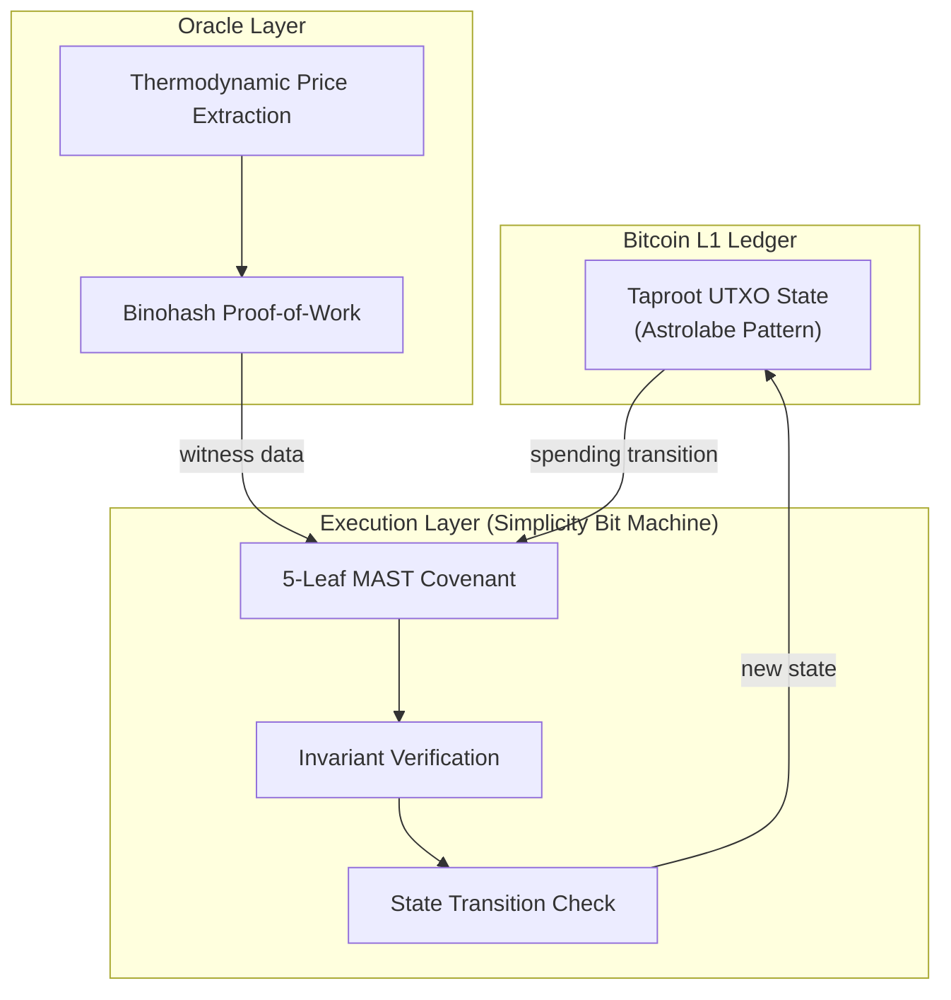
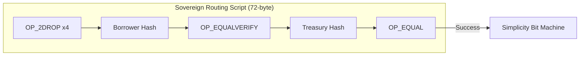

# PRECOP: Predictive Covenant Oracle Protocol

[](https://github.com/4n1s/precop)
[](https://bitcoin.org)
[](https://bitcoin.org/en/taproot)
[](https://blockstream.com/simplicity/)

> **"Sovereign conditional state management where the covenant is the consensus."**

PRECOP (Predictive Covenant Oracle Protocol) is a formally specified protocol for trust-minimized sovereign DeFi on Bitcoin Layer 1. It enables complex financial primitives like Collateralized Debt Positions (CDPs) and Constant-Product AMMs directly on the Bitcoin UTXO set without requiring any soft-forks.

---

## 📑 Table of Contents
- [1. Introduction](#1-introduction)
- [2. Core Architecture](#2-core-architecture)
    - [2.1 Template-Enforced UTXO State Machine (TUSM)](#21-template-enforced-utxo-state-machine-tusm)
    - [2.2 5-Leaf MAST Topology](#22-5-leaf-mast-topology)
    - [2.3 Sovereign Routing & TapLeaf Script](#23-sovereign-routing--tapleaf-script)
- [3. Financial Primitives](#3-financial-primitives)
    - [3.1 $BTCDAI: Sovereign Synthetic Stability](#31-btcdai-sovereign-synthetic-stability)
    - [3.2 Unified DEX: Atomic Swap Symmetry](#32-unified-dex-atomic-swap-symmetry)
- [4. Oracle Infrastructure](#4-oracle-infrastructure)
    - [4.1 Trust Model Evolution](#41-trust-model-evolution)
    - [4.2 Binohash PoW Resolution](#42-binohash-pow-resolution)
- [5. Forensic Observability (Precopscan)](#5-forensic-observability-precopscan)
- [6. Protocol Registry](#6-protocol-registry)
    - [6.1 Protocol Dispatch Matrix](#61-protocol-dispatch-matrix)
    - [6.2 Simplicity Jet Taxonomy](#62-simplicity-jet-taxonomy)
- [7. Implementation Reference](#7-implementation-reference)
    - [7.1 Simfony Logic (DEX)](#71-simfony-logic-dex)
    - [7.2 Dust Threshold Semantics](#72-dust-threshold-semantics)
- [8. Empirical Validation](#8-empirical-validation)
- [9. Technical Specifications](#9-technical-specifications)
- [10. Lineage & Composition](#10-lineage--composition)

---

## 1. Introduction

Decentralized finance on Bitcoin has historically relied on federated committees or sidechains, reintroducing trust asymmetries. **PRECOP** eliminates these by anchoring state transitions to the UTXO set via Taproot key commitments, executed by the **Simplicity Bit Machine**.

> [!IMPORTANT]
> **Sovereign Reality**: PRECOP is not a "simple overlay." It is an axiomatic extension of Bitcoin consensus where the L1 ledger acts as a physical guardrail for the sovereign state.

### Key Philosophical Pillars:
- **Zero Soft-fork Dependency**: Operates natively on current Bitcoin L1.
- **Thermodynamic Truth**: Replaces identity-based trust with verifiable energy expenditure (Binohash).
- **Formal Verification**: Leverages Simplicity's type-theoretic semantics for bit-perfect execution.
- **Forensic Discovery**: State can be reconstructed entirely from raw L1 data via Precopscan.

---

## 2. Core Architecture

### 2.1 Template-Enforced UTXO State Machine (TUSM)

The TUSM is a covenant-enforced automaton where state transitions are authenticated by user signatures and mathematically enforced by the covenant invariants.



### 2.2 5-Leaf MAST Topology

Verification rules are decomposed into a 5-leaf Merkle Abstract Syntax Tree (MAST), ensuring computational efficiency and path isolation.

| Contract | Role | CMR (Identity) | TapLeaf Hash |
| :--- | :--- | :--- | :--- |
| `brc20_cdp` | Sovereign Debt | `8a4d0163...` | `0550a41e...` |
| `univ_dex` | Ask Engine | `f99b37f7...` | `2b48008e...` |
| `bid_dex` | Bid Mirror | `3debe3de...` | `bce51d4b...` |
| `brc20_std` | Sentinel / Guardrail | `1c36b1c3...` | `565708f1...` |
| `stake_enf` | Slasher (W Token) | `39ff339f...` | `b80d9a46...` |

### 2.3 Sovereign Routing & TapLeaf Script

Output Hijacking is cryptographically impossible in PRECOP. Recipient binding is enforced at the script level *before* any Simplicity evaluation.



<details>
<summary><b>View TapLeaf Wire Encoding Anatomy</b></summary>

| Offset | Hex | Opcode / Data | Semantics |
| :--- | :--- | :--- | :--- |
| `0x00` | `6d` | `OP_2DROP` | Discard 2 witness items |
| `0x00-03` | `6d x4` | `OP_2DROP x4` | Clear 8 padding items (LIFO) |
| `0x04` | `20` | `PUSH_32` | Begin borrower SPK hash push |
| `0x05-24` | `[hash]` | `BORROW_SPK_HASH` | Curried 32-byte commitment |
| `0x25` | `88` | `OP_EQUALVERIFY` | Assert stack matches borrower |
| `0x26` | `20` | `PUSH_32` | Begin treasury SPK hash push |
| `0x27-46` | `[hash]` | `TR_SPK_HASH` | Curried 32-byte commitment |
| `0x47` | `87` | `OP_EQUAL` | Final stack result (Result 1/0) |

</details>

---

## 3. Financial Primitives

### 3.1 $BTCDAI: Sovereign Synthetic Stability

$BTCDAI is a synthetic stablecoin where supply is exclusively covenant-controlled. It uses **Elasticity Signaling** (max=0, lim=0) to inform indexers that on-chain covenants are the sole authority for minting.

- **Minting Threshold (150%)**: $C \cdot P \ge D \cdot 150 \cdot 10^8$
- **Liquidation Threshold (120%)**: $C \cdot P < D \cdot 120 \cdot 10^8$
- **Stability Fee**: 2.5% APR enforced by 128-bit cross-multiplication.

### 3.2 Unified DEX: Atomic Swap Symmetry

PRECOP enforces identical cryptographic rigor for both liquidity providers and takers through symmetrical TUSM engines.

| Feature | Ask Side (Universal) | Bid Side (BTC-First) |
| :--- | :--- | :--- |
| **Maker Role** | Seller (locks Asset) | Buyer (locks BTC) |
| **Primary Invariant** | BTC Payment Verification | Asset Delivery Verification |
| **Fee Structure** | 97% Seller / 3% Treasury | 97% Seller / 3% Treasury |

---

## 4. Oracle Infrastructure

### 4.1 Trust Model Evolution

The protocol moves through two security epochs:

1. **Bootstrap Phase (Current)**: Uses Schnorr attestations (`bip340_verify`) for trust-minimized price feeds.
2. **Thermodynamic Phase (Target)**: Pure Binohash PoW resolution where trust is replaced by a peer-to-peer work race.

### 4.2 Binohash PoW Resolution

Oracle votes are validated via Proof-of-Work:
`SHA256(domain || price || height || nonce) ≤ Target`

> [!NOTE]
> This transitions oracle trust from "who signed it" to "how much energy was expended." At $W=60$, forged resolutions are GPU-infeasible.

---

## 5. Forensic Observability (Precopscan)

Precopscan is a Next.js forensic observer that reconstructs the protocol state without central databases.

- **Address Probes**: Scans **7 fixed Taproot P2TR addresses** (one Oracle/Agent0, one Treasury, five protocol Agents).
- **Discovery Flow**: Fetch up to 20 pages (25 tx/page) → Reverse Chronological Replay → Witness Decoding.
- **Decoding Channels**:
    - **CDP Channel (64B)**: `vault_id` ‖ `collateral` ‖ `price` ‖ `debt` ‖ `height`.
    - **DEX Channel (31B)**: `version` ‖ `market_id` ‖ `phase` ‖ `q_yes` ‖ `q_no` ‖ `oracle_cnt`.
    - **BRC-20 Channel (48B)**: `max` ‖ `current` ‖ `ticker_hash`.

| Role | Mutinynet Probe Address |
| :--- | :--- |
| **Agent0 / Oracle** | `tb1pyl3fzr50z0yhydw8zf3gqaru6dt8seh58pgaw73x84xttxjdzpcs8wks36` |
| **Treasury** | `tb1pwj2ycq224fdrmq8xvllx0t4j8tds5jml4canl7cc9z99qmetjqwshe2ftt` |
| **Agent1 / Owner** | `tb1p7t6842hqmfmj2lnf5zeqrzewcvxut4g4cx3jt7t72qpcqk49l4cq93xj69` |

---

## 6. Protocol Registry

<details>
<summary><b>View Opcodes, Jets & Dispatch Matrix</b></summary>

### 6.1 Protocol Dispatch Matrix
PRECOP utilizes **Dynamic Indexing** to support multi-standard assets (BRC-20, Runes, Ordinals) without multiple contract deployments.

| ID | Standard | Output 3 Format | Covenant Index |
| :--- | :--- | :--- | :--- |
| `0` | Universal (BRC-20) | JSON Envelope | Output 1 |
| `1` | Runes | Binary Edict (Hex) | Output 1 |
| `2` | Legacy BRC-20 | JSON Envelope | Output 1 |
| `3+` | Ordinal NFT (ORDI) | None | Output 0 |

### 6.2 State Transition Opcodes
Machine-level constants for TUSM lifecycle management:

| Opcode | Operation | Role |
| :--- | :--- | :--- |
| `0x03` | **MINT** | Opens a new vault |
| `0x04` | **REPAY** | Closes an existing vault |
| `0x05` | **LIQUIDATE** | Force-closes an insolvent vault |
| `0x07` | **FREEZE** | Governance-level suspension |
| `0x0C` | **W_SLASH** | Slashes equivocating oracles |

### 6.3 Simplicity Jet Taxonomy
Hardware-accelerated functions invoked in PRECOP `v1.9.2` contracts:

| Jet | Input/Output | PRECOP Usage |
| :--- | :--- | :--- |
| `output_script_pubkey_hash(n)` | `u32 -> u256` | Sovereign routing SPK assertion |
| `output_amount(n)` | `u32 -> u64` | Dust invariant (`== 546`) & fee ratios |
| `multiply_64(a, b)` | `(u64,u64) -> u128` | 128-bit ratio enforcement (CDP/AMM) |
| `eq_256(a, b)` | `(u256,u256) -> bool` | Constant-time equality for metadata/SPK |
| `ge_128(a, b)` | `(u128,u128) -> bool` | Stability fee threshold enforcement |
| `bip340_verify(pk,m,s)` | `(256,256,512)->bool` | Bootstrap oracle Schnorr attestation |
| `sha256_ctx_8_add_8(c,d)` | `(ctx,u64) -> ctx` | Anti-collision oracle hashing ($P \parallel H$) |

</details>

---

## 7. Implementation Reference

### 7.1 Simfony Logic (DEX)

The following Simfony source demonstrates the 128-bit cross-multiplication invariant used for fee enforcement in `universal_dex.simf`.

```rust
// Role: Universal Atomic Swap / OTC Trade Engine.
// Invariants: 3% Fee, Asset Delivery to Output 0, Oracle Signature.

fn main() {
    let seller_out = jet::output_amount(1); 
    let treasury_out = jet::output_amount(2); 
    let ask_amount = witness::ASK_AMOUNT; 

    // 97% Seller / 3% Treasury Ratio Verification
    jet::verify(ge_128(jet::multiply_64(seller_out, 100), jet::multiply_64(ask_amount, 97))); 
    jet::verify(ge_128(jet::multiply_64(treasury_out, 100), jet::multiply_64(ask_amount, 3))); 

    // Asset Delivery Invariant (Output 0 == 546 sats)
    jet::verify(jet::eq_256(witness::BUYER_SPK_HASH, jet::output_script_pubkey_hash(0))); 
    jet::verify(jet::eq_64(jet::output_amount(0), 546)); 
}
```

### 7.2 Dust Threshold Semantics

PRECOP utilizes two semantically distinct dust thresholds to optimize ledger efficiency without sacrificing relay acceptance.

| Threshold | Value | Scope |
| :--- | :--- | :--- |
| **Standard Dust** | 546 sats | External wallet outputs (buyer, borrower) |
| **Creator Dust** | 330 sats | Protocol-internal anchors (parallelization) |

---

## 8. Empirical Validation

The protocol has undergone rigorous stress testing on Mutinynet (Height 104,200).

- **Test-AMM-K**: Validated monotonic $k$ growth on 1,000 randomized swaps. Result: **100% stable/positive drift**.
- **Test-CDP-MARGIN**: Verified bit-perfect phase transition at the 120.0% boundary.
- **Reorg Survival**: Successfully survived simulated 3-block reorgs with zero state divergence.
- **Parallel Throughput**: Demonstrated $20\times$ concurrent trade parallelization via Creator Dust Pools.

---

## 9. Technical Specifications

<details>
<summary><b>View Witness-Flare Stack Layout (v40 CDP)</b></summary>

Items are consumed LIFO (Top-to-Bottom):

1. `[N-1]` Control Block
2. `[N-2]` Simplicity Script (`brc20_cdp.simf`)
3. `[N-3]` Vault JSON Hash
4. `[N-4]` Strategic Padding
5. `[N-5]` OpType (e.g., 0x03 for Mint)
6. `[N-6]` Schnorr Signature / PoW Nonce
7. `[N-7]` BTC Price (cents)
8. `[N-8]` Collateral (sats)
9. `[N-9]` Stability Penalty
10. `[N-10]` Borrower SPK Hash
11. `[N-11]` Treasury SPK Hash
12. `[N-12]` Last Update Height

</details>

<details>
<summary><b>View TUSM State Memory Layout</b></summary>

Canonical 31-byte State Vector:

| Offset | Size | Field | Endianness |
| :--- | :--- | :--- | :--- |
| `0x00` | 1 byte | `version` (0x05) | N/A |
| `0x01` | 8 bytes | `vault_id` | BE |
| `0x09` | 1 byte | `phase` | N/A |
| `0x0A` | 8 bytes | `collateral` (sats) | BE |
| `0x12` | 8 bytes | `debt` (10^8) | BE |
| `0x1A` | 5 bytes | `reserved` | N/A |

</details>

---

## 7. Lineage & Composition

PRECOP is a vertical composition of proven L1 technologies:

1. **Layer 0**: Bitcoin L1 UTXO Set (Nakamoto, 2008)
2. **Layer 1**: Thermodynamic Price (UTXOracle + Openclaw)
3. **Layer 2**: Hash-As-Signature (sha2-ecdsa, Linus 2024)
4. **Layer 3**: Oracle Sealing (Binohash PoW, Linus 2024)
5. **Layer 4**: Taproot MAST (BIP-341, Wuille 2020)
6. **Layer 5**: TUSM Covenant (Simplicity, Poelstra/O'Connor)

---

## 🔗 Resources
- **Yellowpaper**: [precop_yellowpaper.pdf](./precop_yellowpaper.pdf)
- **Covenant Source**: [simplicity-unchained](https://github.com/BitcoinWorldTrustfoundation/simplicity-unchained)
- **Explorer**: [Precopscan]() (TBA)
- **Stablecoin**: [BTCdai]() (TBA)

---

*PRECOP Protocol v0.0.2 | Sovereign DeFi by Primitive Stacking*
